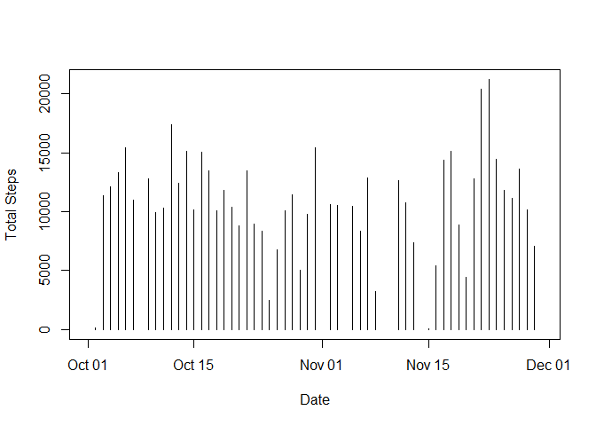

## Loading and preprocessing the data  
  
*1. Load the data*  
  

```r
activity <- read.csv(unz("activity.zip", "activity.csv"))
```
  
*2. Process/transform the data (if necessary) into a format suitable for your analysis*  
  
Convert the date column into dates.  
  

```r
activity$date <- as.Date(as.character(activity$date), "%Y-%m-%d")
```
  
## What is mean total number of steps taken per day?  
  
*1. Calculate the total number of steps taken per day * 
  

```r
library(dplyr)
```

```
## 
## Attaching package: 'dplyr'
```

```
## The following objects are masked from 'package:stats':
## 
##     filter, lag
```

```
## The following objects are masked from 'package:base':
## 
##     intersect, setdiff, setequal, union
```

```r
ac_groups <- group_by(activity, date)
steps_day <- summarize(ac_groups, sum(steps))
```
  
*2. Make a histogram of the total number of steps taken each day*


```r
plot(steps_day, type = "h", xlab = "Date", ylab = "Total Steps")
```

<!-- -->

*3. Calculate and report the mean and median of the total number of steps taken per day*


```r
step_mean <- format(mean(steps_day$`sum(steps)`, na.rm = TRUE), digits = 6)
step_median <- median(steps_day$`sum(steps)`, na.rm = TRUE)
```
   
The mean number of steps per day is **10766.2**, and the median is **10765**.  
  
## What is the average daily activity pattern?  
  
*1. Make a time series plot of the 5-minute interval (x-axis) and the average number of steps taken, averaged across all days (y-axis)*    
  

```r
library(dplyr)
interval <- activity %>% group_by(interval) %>% summarize(mean(steps, na.rm = TRUE))
plot(interval, type = 'l', xlab = "interval number", ylab = "average steps taken each day")
```

<!-- -->
  
*2. Which 5-minute interval, on average across all the days in the dataset, contains the maximum number of steps?*  
  

```r
interval_max <- interval$interval[which.max(interval$`mean(steps, na.rm = TRUE)`)]
```
    
Interval **835** has the higest number of steps on average.
  
  
## Imputing missing values  
  
*1. Calculate and report the total number of missing values in the dataset (i.e. the total number of rows with NAs)*  
  

```r
na_rows <- sum(sapply(activity, is.na))
```
  
There are **2304** missing values in the dataset!  
  
*2. Devise a strategy for filling in all of the missing values in the dataset. The strategy does not need to be sophisticated. For example, you could use the mean/median for that day, or the mean for that 5-minute interval, etc.*  
  
I will use the mean for the interval across all days to impute missing values.
  
*3. Create a new dataset that is equal to the original dataset but with the missing data filled in.*  
  

```r
activity2 <- activity
for(row in 1:nrow(activity2)){
    if(is.na(activity2$steps[row])){
        activity2$steps[row] <- interval$`mean(steps, na.rm = TRUE)`[interval$interval == activity2$interval[row]]
    }
}
```
  
*4. Make a histogram of the total number of steps taken each day and Calculate and report the mean and median total number of steps taken per day. *  
  

```r
library(dplyr)
ac_groups2 <- group_by(activity2, date)
steps_day2 <- summarize(ac_groups2, sum(steps))
plot(steps_day2, type = "h", xlab = "Date", ylab = "Total Steps")
```

<!-- -->

```r
step_mean2 <- format(mean(steps_day2$`sum(steps)`, na.rm = TRUE), digits = 6)
step_median2 <- format(median(steps_day2$`sum(steps)`, na.rm = TRUE), digits = 6)
```
  
The new mean is **10766.2** and the new median is **10766.2**.  
  
*Do these values differ from the estimates from the first part of the assignment?*   
  
The new mean is the same, but the new median has changed because it uses one of
the averaged values.  As a result, it's no longer an integer.
   
*What is the impact of imputing missing data on the estimates of the total daily number of steps?*  
  
Imputing missing data impacted the dates with missing data, in proportion to the
number of missing observations.  The overall impact is small. The most noticable
change is that some days in the histogram that were empty now have lines.  
  
## Are there differences in activity patterns between weekdays and weekends?  
  
*For this part the weekdays() function may be of some help here. Use the dataset with the filled-in missing values for this part.*  
  
*1. Create a new factor variable in the dataset with two levels – “weekday” and “weekend” indicating whether a given date is a weekday or weekend day.*  
  

```r
activity2$daytype <- factor(c("weekday", "weekend"))

for(row in 1:nrow(activity2)){
    if(weekdays(activity2$date[row]) == "Saturday" | 
       weekdays(activity2$date[row]) == "Sunday"){
        activity2$daytype[row] <- "weekend"
    }
    else{
        activity2$daytype[row] <- "weekday"
        }
}
```
  
*2. Make a panel plot containing a time series plot of the 5-minute interval (x-axis) and the average number of steps taken, averaged across all weekday days or weekend days (y-axis). See the README file in the GitHub repository to see an example of what this plot should look like using simulated data.*  
  

```r
library(dplyr)
interval2 <- activity2 %>% group_by(interval, daytype) %>% summarize(mean = mean(steps))

library(lattice)
xyplot(mean ~ interval | daytype, interval2, layout = c(1,2), type = "l")
```

<!-- -->

